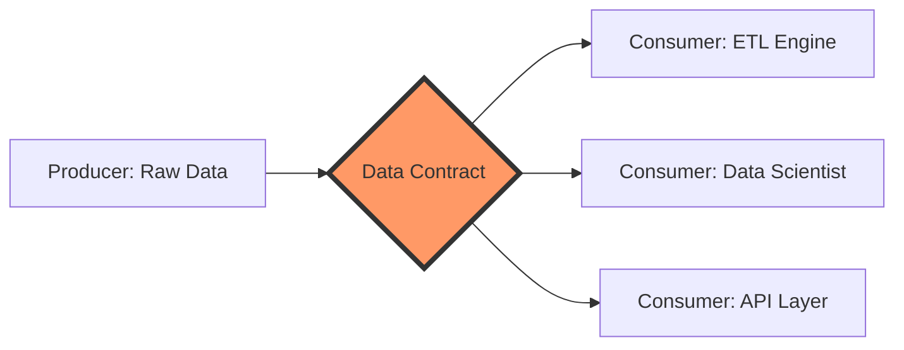

# Contract-First Data Engineering

Contract-First Data Engineering is a paradigm shift where the **Interface (The Contract)** is defined and agreed upon *before* any data is produced or consumed. This prevents the common problem of "Silent Data Corruption" and "Pipeline Breakages."

## 1. Traditional vs. Contract-First

| Feature | Traditional ETL (Code-First) | Contract-First |
| :--- | :--- | :--- |
| **Source of Truth** | The code itself. | The Schema/Contract file. |
| **Drift Detection** | Pipeline crashes during run. | Validation happens *before* run. |
| **Communication** | "I sent you a file, try to parse it." | "I sent you a file that matches *this* contract." |
| **Scalability** | Hardcoded scripts for every new source. | Generic engine that reads contracts. |

## 2. The Workflow Diagram



## 3. Simple Python Example: The "Enforcer"

This script demonstrates how a contract (represented here as a simple dictionary) is used to validate incoming data *before* processing.

```python
# The 'Contract'
expected_schema = {
    "system_id": int,
    "name": str,
    "x": float
}

# The 'Incoming Data'
raw_record = {"system_id": 12345, "name": "Sol", "x": "0.0"} # 'x' is a string!

def validate_record(record, schema):
    for field, expected_type in schema.items():
        if field not in record:
            raise ValueError(f"Missing field: {field}")
        if not isinstance(record[field], expected_type):
            # The Enforcer stops the pipeline here
            raise TypeError(f"Field {field} must be {expected_type}, not {type(record[field])}")

try:
    validate_record(raw_record, expected_schema)
except Exception as e:
    print(f"Contract Violation: {e}")
```

## 4. Why Use It?
- **Decoupling:** You can change the ETL logic without changing the schema.
- **Self-Documentation:** The contract *is* the documentation.
- **Trust:** Consumers (like your API) know exactly what data they are getting.
