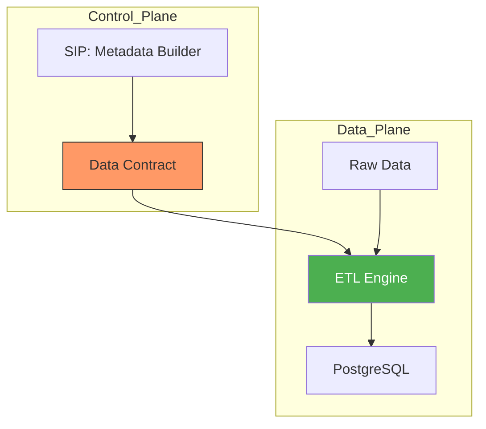

# Metadata-Driven Pipelines

A Metadata-Driven Pipeline is a **Generic Engine** that performs ETL based on an external configuration (The Metadata) rather than being hardcoded.

## 1. Hardcoded vs. Metadata-Driven

| Scenario | Hardcoded (Scripts) | Metadata-Driven (Generic) |
| :--- | :--- | :--- |
| **Adding a New Table** | Write a new 100-line Python script. | Add a 20-line JSON config file. |
| **Logic Change** | Edit all 10 script files individually. | Edit the core Engine code once. |
| **Deployment** | Requires a code change/re-deployment. | Only requires updating the "Contract". |

## 2. The Engine-and-Recipe Pattern



## 3. Simple Python "Generic Engine" Example

This example shows how a single `run_etl` function can handle any table just by reading its "Recipe."

```python
import json

# A "Metadata" Recipe
recipes = {
    "systems": {
        "source": "systems.json",
        "columns": ["id64", "name"],
        "table": "stg_systems"
    },
    "stations": {
        "source": "stations.json",
        "columns": ["id", "name", "distance"],
        "table": "stg_stations"
    }
}

def etl_engine(entity_name):
    # The "Engine" logic is identical for all tables
    recipe = recipes[entity_name]
    print(f"Loading {recipe['source']} into {recipe['table']}...")
    print(f"Selecting columns: {', '.join(recipe['columns'])}")

# To add a new source (e.g., 'factions'), we just update the 'recipes' dict.
# We don't write new functions or new code.
etl_engine("systems")
etl_engine("stations")
```

## 4. Scaling the Generic Engine
- **Parametrized SQL:** Use the metadata to inject column names into a SQL string.
- **Dynamic Normalization:** The metadata tells the engine whether to `UNNEST` (explode) an array or not.
- **Automated Validation:** The engine reads the "Expected Types" from the metadata and enforces them.
