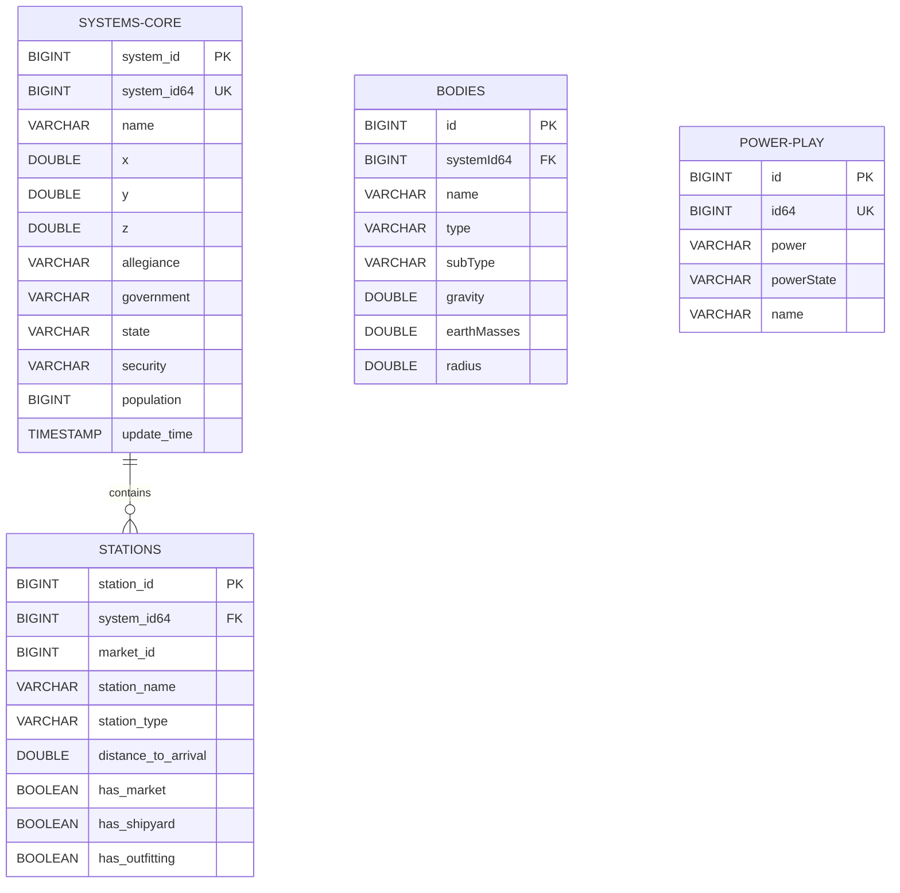

# Data Normalization & Relational Schema

This document describes the transformation of raw nested JSON data into a normalized relational structure optimized for analytical queries in Parquet.

## Normalization Strategy: Systems & Stations

The primary normalization occurs on the `systemsPopulated` dataset. In its raw form, stations are nested as an array within each system object. To optimize for columnar storage and join-based analysis, we split this into two flat tables.

### Mermaid Schema Diagram

## Relational Tables (Normalized)

### Table: `systems_core`
Derived from the root of `systemsPopulated.sample.json`.

| Column | Type | Source Property | Description |
| :--- | :--- | :--- | :--- |
| `system_id` | BIGINT | `id` | Internal EDSM ID |
| `system_id64` | BIGINT | `id64` | 64-bit Elite Dangerous ID |
| `name` | VARCHAR | `name` | System Name |
| `x` | DOUBLE | `coords.x` | X Coordinate |
| `y` | DOUBLE | `coords.y` | Y Coordinate |
| `z` | DOUBLE | `coords.z` | Z Coordinate |
| `allegiance` | VARCHAR | `allegiance` | System Allegiance |
| `government` | VARCHAR | `government` | System Government |
| `state` | VARCHAR | `state` | System State |
| `security` | VARCHAR | `security` | Security Level |
| `population` | BIGINT | `population` | Total Population |
| `update_time` | TIMESTAMP | `date` | Record Timestamp |

### Table: `stations`
Derived by unnesting the `stations` array in `systemsPopulated.sample.json`.

| Column | Type | Source Property | Description |
| :--- | :--- | :--- | :--- |
| `station_id` | BIGINT | `stations[].id` | Internal Station ID |
| `system_id64` | BIGINT | `id64` (parent) | Link to `systems_core` |
| `market_id` | BIGINT | `stations[].marketId` | Market Unique Identifier |
| `station_name` | VARCHAR | `stations[].name` | Name of the Station |
| `station_type` | VARCHAR | `stations[].type` | Type (e.g., Starport, Outpost) |
| `distance_to_arrival`| DOUBLE | `stations[].distanceToArrival` | Distance from Star |
| `has_market` | BOOLEAN | `stations[].haveMarket` | Market Availability |
| `has_shipyard` | BOOLEAN | `stations[].haveShipyard` | Shipyard Availability |
| `has_outfitting` | BOOLEAN | `stations[].haveOutfitting` | Outfitting Availability |

## Correspondence to Samples

| Relational Table | Source Sample File | Normalization Script |
| :--- | :--- | :--- |
| `systems_core` | `systemsPopulated.sample.json` | `normalize_to_parquet.py` |
| `stations` | `systemsPopulated.sample.json` | `normalize_to_parquet.py` |
| `bodies7days` | `bodies7days.sample.json` | Direct (Proposed) |
| `powerPlay` | `powerPlay.sample.json` | Direct (Proposed) |
| `systems_delta` | `systems_1day.sample.json` | Direct (Proposed) |
